# QA-DevOps-Core-Practical-Project
## Encounter Generator
### By Ahsan Rasul
 
## Objective
 
The objective of this project is to create and deploy a containerised app using at least 4 microservices that will work together. 
* Service 1 will be the front-end and will allow users to interact with the application. It will communicate with the other 3 services.
* Service 2 & 3 will be responsible for generating some form of random object, and sending them to service 1
* Service 4 will receive the two random objects generated by services 2 & 3 and sent to it by service 1, it will then use this data to procedurally generate a response, and send it back to service 1.
 
## Tech stack
 
The requirements of the project lead to the following tech stack.
* A Kanban board, for this I am using [Jira](https://rasul-ahsan.atlassian.net/jira/software/projects/QCDPP/boards/1), with multiple sprints
* Python for the coding, together with Jinja for templating as necessary
* Version Control will be Git with Github used as the remote repository
* Jenkins will be used as the CI and CD server, and it will utilise a webhook so that any push to the main branch will initiate rebuilding and redeployment of the changed application.
* The application will consist of at least 4 microservices
* Docker will be used for containerisation, and Docker Swarm will be the Orchestration tool
* Ansible will be used as a configuration manager.
* NGINX will be used as a reverse proxy
 
## Project Design
 
The Key user story for the application was "As a DM I would like to randomly generate monsters for my party to encounter".  This gave the following service relationship diagram, as I decided what each service would do.
 

 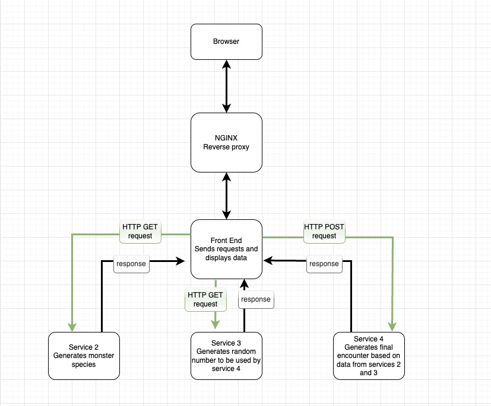

 
And the following Kanban board was created for sprint 1
 

 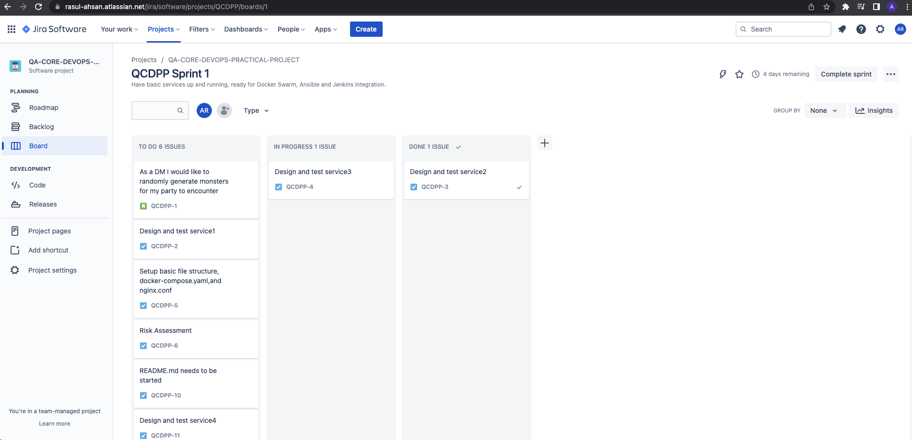

 
And this is the basic risk assessment, once again something that I find hard considering my lack of experience.
 

 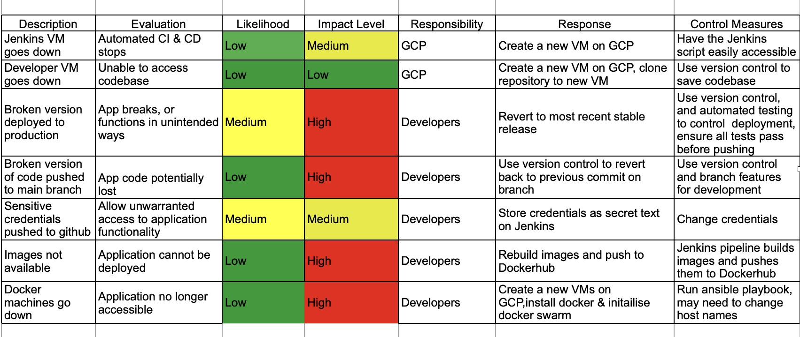

 
* Service 1 (front-end)- will display a webpage through which the user will interact with the application, onload or refresh the app will make a number of HTTP requests to services 2, 3, & 4. It will make a GET request to services 2 & 3, then using the responses it will then make a POST request to service 4, and then display the response from service 4. Initially the service needed the reload this page button on the browser to be pressed inorder to display a different encounter, so I decided to add a small button that the user could click to get another encounter.
 
* Service 2 (monster species) - upon receiving a GET request, it will use the choice method from random, to randomly select from a list of monster species.
 
* Service 3 (monster type) - is the simplest of the services simply using randint from random, to return a value between 1 and 6 upon receiving a GET request, as monster type. Initially the service cast the return value to a string, but I decided to use JSON instead for clarity of what the return should be and to make implementation of service 4 simpler.
 
* Service 4 (monster class) - will receive a POST request, containing both monster species and monster type, as JSON. It will then use both these values to traverse a dictionary containing a list of unique monster classifications. The monster species will be used as the key to find the appropriate list, and the integer from service 3 is used for the index in the list.  Then depending on the value generated, conditionals are used to generate the appropriate response string, which is sent back to Service 1.  This service led to a bug and required the conditionals to be rewritten as detailed in the Issues and Bugs section.
 
As I implemented the services, I decided that I would like to incorporate an external api to retrieve data on the monster to be displayed, unfortunately the only external [d&d api](https://www.dnd5eapi.co/docs/#get-/api/monsters/-index-) did not include most of the monsters I had selected to be used, and as such it did not make it into version 1 of the application.
 
Finally a fifth service consisting of a nginx reverse proxy is used, this alowed traffic on port 80 to be redirected to port 5000 on the front end service.  This can help protect the application from unwelcome connections to the application.
 
## Deployment
 

 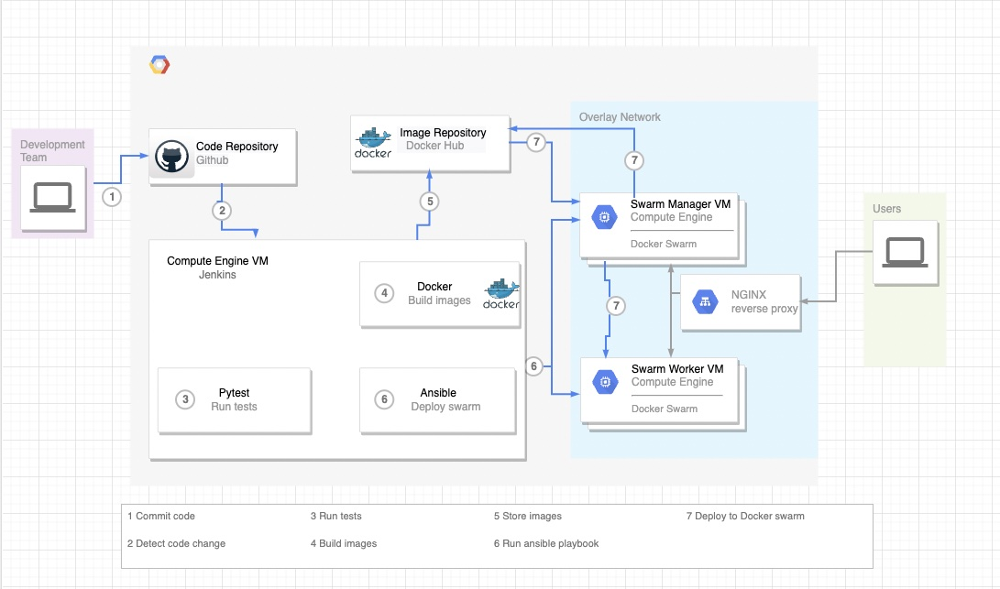

 
Here we can see all the steps of the deployment pipeline. Firstly the developer pushes code to the code repository (step 1), in my case [Github](https://github.com/ashtroboy79/QA-DevOps-Core-Practical-Project), this causes a Webhook to sent a POST request to the Jenkins server (step 2) , this machine needs to have docker, docker compose and ansible installed. The Jenkinsfile is then used to run the pipeline, firsts the tests are run to ensure that the code is still functional (step 3), next the images of the applications are built using docker compose (step 4), and pushed to an external image repository, in this case Docker Hub (step 5). Next the ansible playbook is run, this will install docker onto the host machines and initialise a swarm (step 6), an ansible playbook should be idempotent, meaning that it should be able to be run multiple times without changing the result beyond the initial application, thus allowing it to be run multiple times without causing unintended effects. For this application this means that once the swarm is set up the ansible playbook should not change anything about its structure. Lastly the swarm manager will pull the images from docker hub and deploy the swarm as specified in the docker-compose.yaml (step 7). We can see the app services running on the manager and worker below, and the app frontpage in the following images.
 

 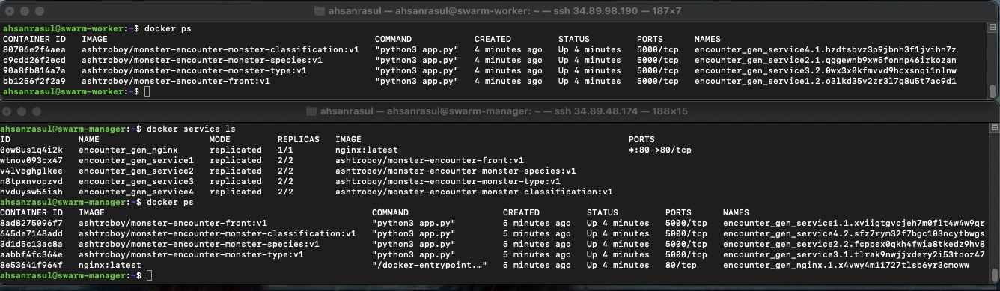

 

 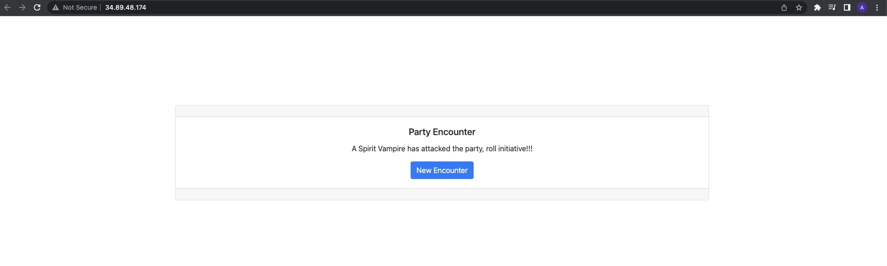

 
The application has been updated to use an nginx load balancer, while this would mean that the swarm can be set up to not accept http traffic and thus  only be accessible via the public address of the load balancer, as service 1 is making an external api call removing http access causes an error, and I am not able to fix it myself at the moment. Currently a load balancer is superfluous as the swarm is only running on a single vm, however it is hoped that once the gcp issue is resolved and multiple swarm workers are available then it will be much more useful.
 
## Feature branch
 
Git and Github allow the use of branching; this is used to keep the code base stable. The development branch was used, and then this was branched off to develop different features, once I was happy with the feature this would be merged back with the development branch. Once the initial app was complete and was checked using docker-compose, the code was pushed to the main branch. The main branch can then be branched off for further development. 
 
## Test Results
 
I endeavoured to follow a TDD when writing my services, however my inexperience resulted in a few issues, one which is mentioned below in Issues and Bugs, this wasn't picked up by my tests at the time as I hadn't thought to check the size of the arrays in the dictionary and had assumed that as the few tests I had written gave 100% coverage and were passing, that I was fully covered. This obviously was not the case, and led to rewriting that test suite. Mocking responses for other services was a key part of testing the application, and was an essential part of services 1, 2,and 3, as when running the tests on service 1, the other services would not be live, and services 2 & 3 rely on random output. I have not been able to use automated integration testing using selenium as yet, and have instead manually tested the interaction on the frontpage.  Jenkins is currently running the tests on each build, I would like to look into amending the pipeline so that if the tests do not all pass then the pipeline will fail, and thus reducing the risk of deploying broken code. All tests are passing and coverage is 100%.
 

 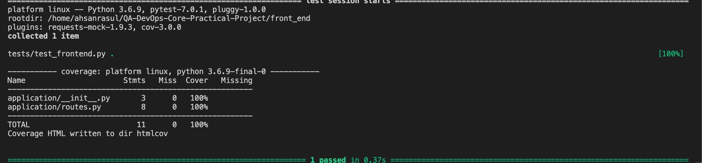

 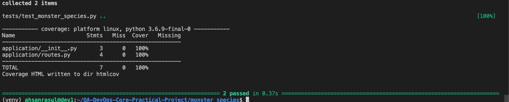

 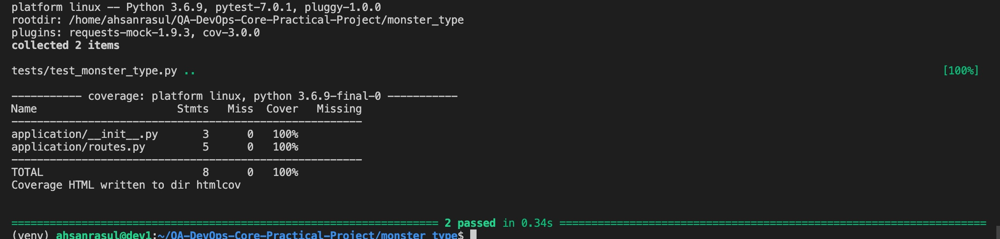

 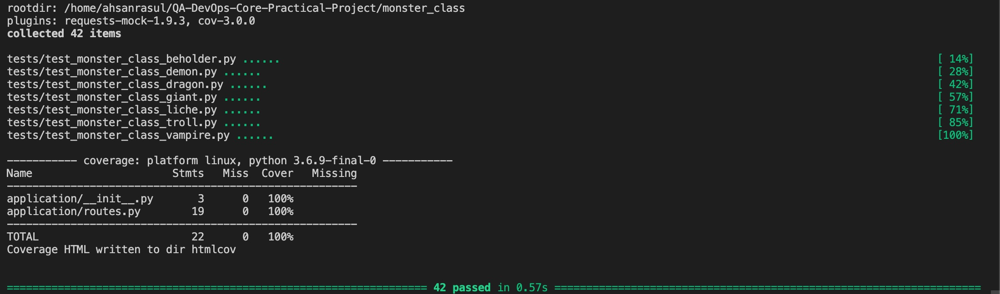

 
 
## Further Development
 
As stated earlier I had hoped to incorporate an external api into the application, as such when designing the next version, I checked the api to see what resources it could provide and what items I could call it on. As such, the current version on the dev branch has the following interactions as per the following service relationship diagram.
 

 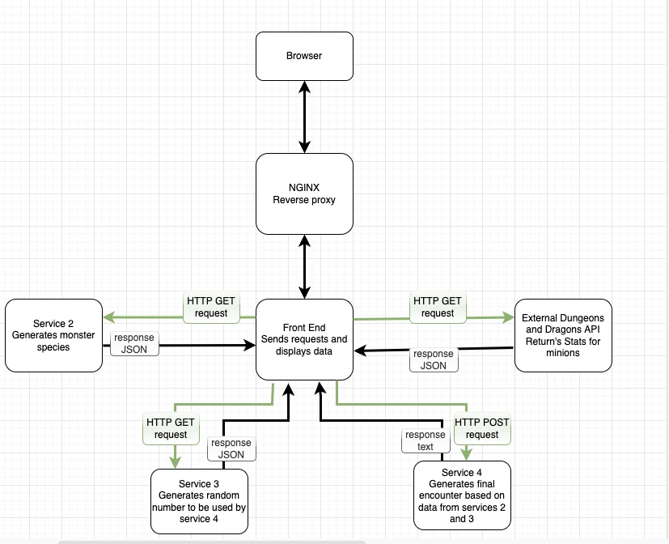

 
A few screenshots of version 2 running

 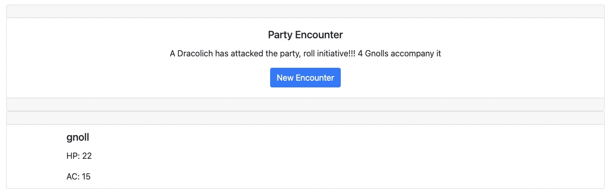

 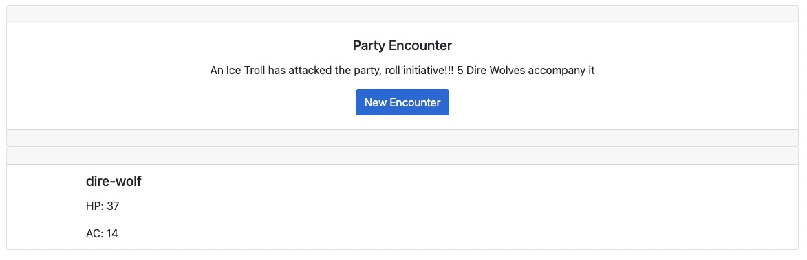

 
## Version 2 tests
 
The test suite was adapted for version 2, as both services 2 and 3 generated random output, the standard patch had to be amended to allow for the mocking of multiple values, after much trial and error and searching online, I was able to come across a suitable solution, which involved substituting return_value, with side_effect which could take a list of values that could be iterated against with multiple asserts, though a loop could also have been used, I choose the format I did for clarity and to ensure it did what I wanted it to do. The tests were updated to include the extra data, and I ran various manual experiments to check that the tests weren't spuriously passing, as below, and once I was happy with my confidence in the tests, I continued on.

 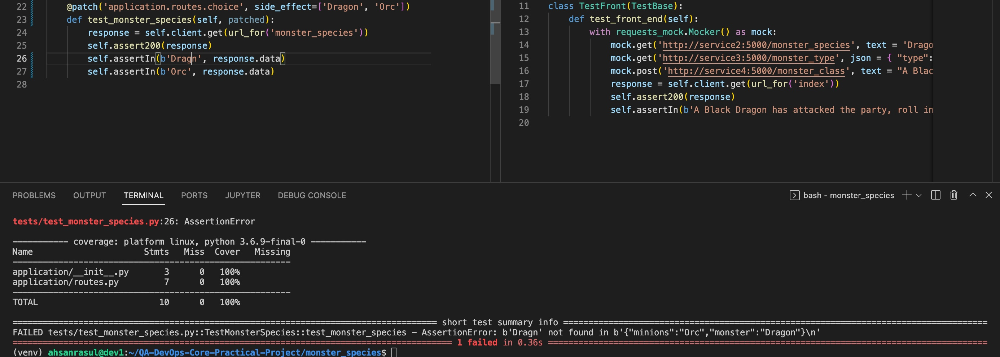

 
As can be seen all the tests on version 2 pass, with 100% coverage.

 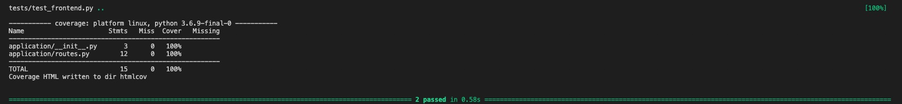

 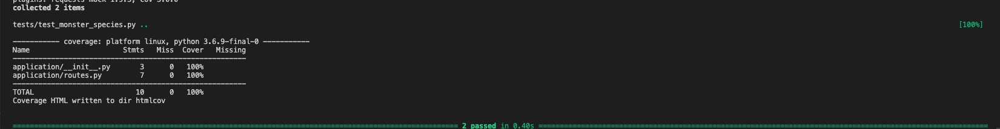

 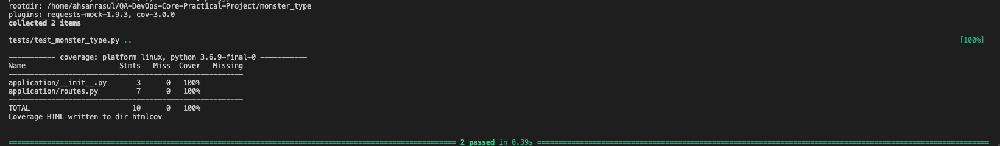

 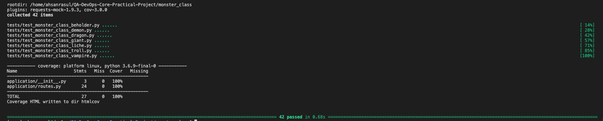

 
## Issues and Bugs
 
The first run of the app resulted in a bug, as shown below
 

 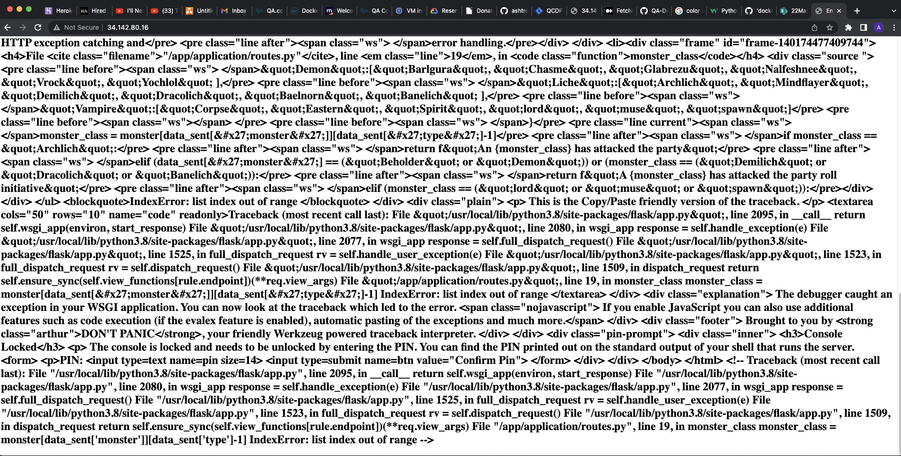

 
The bug was caused because the beholder array only had 5 items not 6, as even though the test report showed that I had 100% coverage I was not actually checking all the possible cases, this lead to me writing a more robust test suite, this in turn led me to discovering that python does not like multiple **or** statements, or atleast the way I had written them in the if statements meant that the new tests were not passing, as such the conditional for these was changed from
 
   if x == (a or b or c)
   to
   if x in (a, b,c)
 
 
GCP seems to have issues with running the swarm such that even though the swarm-worker is running services as can be seen in the image from the deployment section, when I attempt to visit the app on the swarm-worker, I end up with **This site can’t be reached The connection was reset**. Upon further inspection it turns out that if service1 is on the worker then it fails to return data to the nginx on the manager, all other traffic between the app is bi-directional. This is the case even with the network explicitly set to an overlay network, which allows containers on different hosts to communicate with each other, as per the diagram below.  Even with support no solution or reason has been found as of 05/07/22. As such the swarm worker has been taken offline and the swarm will only consist of the swarm-manager, the playbook and inventory have the role commented out so that should a solution be found then it can be reinserted with minimal difficulty
 
 
## Future Development
 
* Add a load balancer - added 07/07/22
* Run the application with a Gunicorn WSGI server rather than as a native flask app implementation started 08/07/22
* Add a SQL to store any previous encounters
 
## Credits and acknowledgments
 
Leon Robinson, Adam Gray, for all their instruction and assistance in troubleshooting, and the members of the 22MayEnable1 cohort for their assistance in troubleshooting issues.
 
https://www.digitalocean.com/community/tutorials/how-to-use-ansible-to-install-and-set-up-docker-on-ubuntu-20-04 and https://medium.com/@pierangelo1982/install-docker-with-ansible-d078ad7b0a54 for how to get ansible to install docker.
 
https://blog.networktocode.com/post/Accessing-other-host-variables-in-Ansible/ for how to access variables from on host and use them in another host
 
[Bootstrap cards](https://getbootstrap.com/docs/4.0/components/card/)and [Bootstrap buttons](https://getbootstrap.com/docs/4.0/components/card/) from https://getbootstrap.com/

https://betterprogramming.pub/create-a-running-docker-container-with-gunicorn-and-flask-dcd98fddb8e0 for how to containerise a gunicorn app
 
### Version
 
Version 1.0
Version 2.0 to be deployed during presentation
